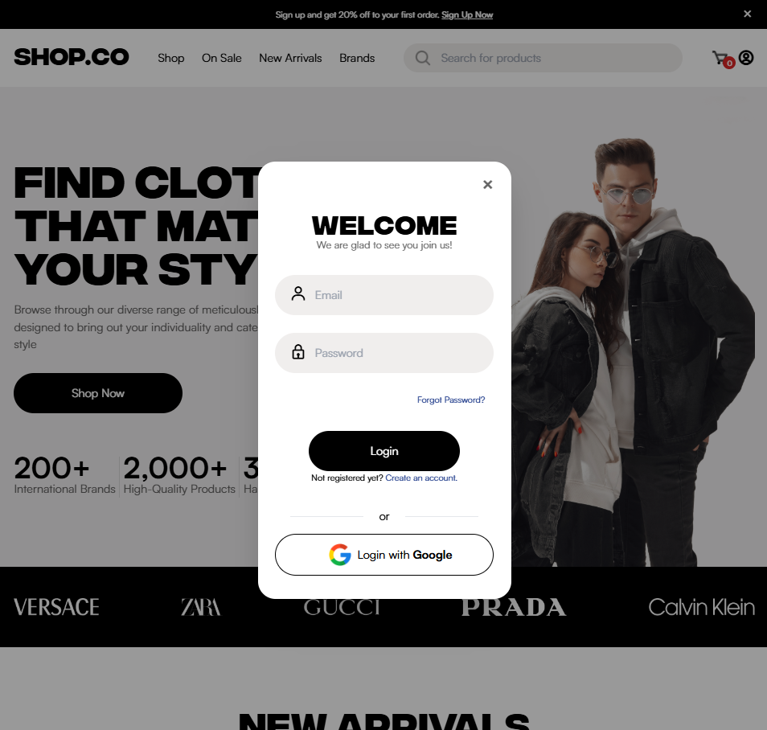

# Shop.Co - An E-Commerce Website

This is the implementation of an e-commerce website based on a sample Figma design. The project uses **Tailwind CSS** for styling and **Firebase** services for backend functionality such as authentication, database management, and storage.

## Project Overview

The purpose of this project is to develop a responsive, user-friendly, and visually appealing e-commerce website. The UI closely follows a **Figma design** template to ensure a consistent and high-quality user experience.

### Key Features:
- **Responsive Design**: Fully responsive layout optimized for desktops, tablets, and mobile devices.
- **Tailwind CSS**: A utility-first CSS framework to streamline the styling process.
- **Firebase Authentication**: Enables secure user authentication with email/password and social media login.
- **Firebase Firestore**: Real-time database for storing and retrieving product data.
- **Firebase Storage**: Used for hosting product images and other media assets.
- **AI Chat bot**: Used fine tuned openai model for chat bot assistant.
- **Shopping Cart**: Allows users to add, update, and remove products in their cart.

## Technologies Used:
- **Frontend**:
  - **React**: JavaScript library for building user interfaces.
  - **Tailwind CSS**: Utility-first CSS framework for styling.
- **Backend/Services**:
  - **Firebase**:
    - **Authentication**: Handles user login and sign-up.
    - **Firestore**: A real-time database for storing product data.
    - **OpenAI**: fine tuned AI model for chat bot feature.
    - **Storage**: Manages product images and other media.
    - **Hosting**: Netlify hosting with CI/CD for easy deployment and fast content delivery.

## The application is available at [https://ecommerce-dev-richard.netlify.app/](https://ecommerce-dev-richard.netlify.app/).

## Firebase Services

### Authentication:
- Supports **Email/Password** logins.
- You can sign up, log in, and log out using Firebase Authentication.

### Firestore Database:
- Products are dynamically loaded from Firestore.
- The database stores product details such as name, price, description, and images.

### Storage:
- Product images and other assets are managed via Firebase Storage.

## Features

- **User Authentication**: Sign up, log in, and log out with Firebase Authentication.
- **Product Listings**: Dynamically fetched from Firestore, users can browse and filter products.
- **Shopping Cart**: Users can add products to the cart and view the total price.

## Contributing

Feel free to open issues or submit pull requests. Contributions are welcome for bug fixes, new features, or improvements.

## Design Credit

This project is based on a free design from the Figma Community.
Design by hamzanaeem778@gmail.com — [Link to Figma Design](https://www.figma.com/community/file/1273571982885059508).

---

